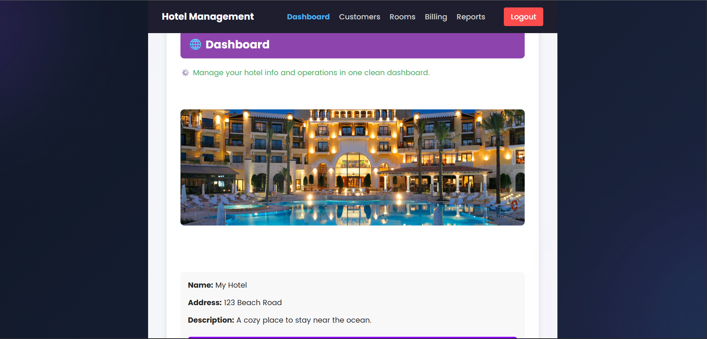
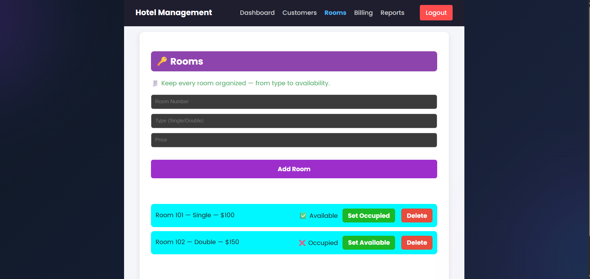

<h1 align="center">Hotel Management System</h1>
<p align="center">
  A modern, responsive hotel management application built using <strong>React + Vite</strong>.
</p>

<p align="center">
  
  
  
  
  
</p>


## Overview
The **Hotel Management System** is a feature-rich, responsive web application designed to simplify daily hotel operations such as room management, customer record maintenance, billing, and generating analytical reports.  
This system provides a clean dashboard interface with easy navigation and smooth user experience.


## Features

### Dashboard
- Centralized overview of hotel operations  
- Manage hotel details and upload images  
- Clean, desktop-style UI  

### Customers
- Add, edit, and delete customers  
- Assign rooms  
- Search and manage records  

### Rooms
- Add rooms with type & price  
- Toggle availability (Available/Occupied)  
- Delete room entries  

### Billing
- Auto-generate bills  
- Calculate total stay cost  
- Manage and delete billing records  

### Reports
- Generate and download customer stay reports  
- Helpful for management and analysis  

## Screenshots
### Login Page


### Dashboard


### Customers


### Rooms


### Billing


### Reports


## Tech Stack

| Area | Technology |
|------|------------|
| Framework | React.js (Vite) |
| Language | JavaScript (ES6) |
| Styling | CSS |
| Routing | React Router DOM |
| Deployment | Vercel / Netlify |

---

## Installation and Setup

### Clone the Repository
```bash
git clone https://github.com/Adith-techie/hotel-management-app.git
cd hotel-management-app
```

### Install Dependencies
```bash
npm install
```

### Run Development Server
```bash
npm run dev
```

### Create Production Build
```bash
npm run build
```

### Preview Production Build
```bash
npm run preview
```

---

## Future Enhancements

- Backend database integration (MongoDB, Firebase, SQL)
- Online room booking system
- Multi-user roles (Admin, Manager, Staff)
- PDF invoice generation and exporting
- Real-time analytics dashboard and charts
- Notification system (Email/SMS)
- Complete booking history with filtering and search
